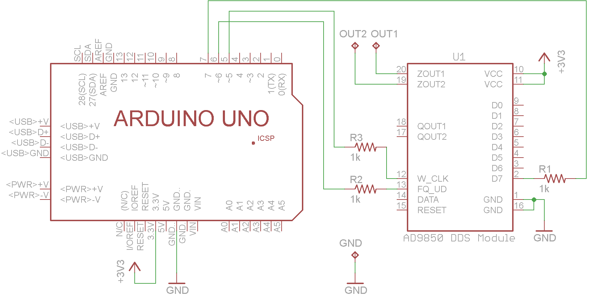

Made with Eagle 7.4.0 Lite. (Free version)

These files show the default conntections for the JDDS-Arduino and a posible shield for an Arduino Uno.

With [Eagle PCB software](http://www.cadsoftusa.com/) You can modify the schematic and PCB to suit your needs.

Schematic of the connections

Possible shield for the Arduino Uno

Jonti
