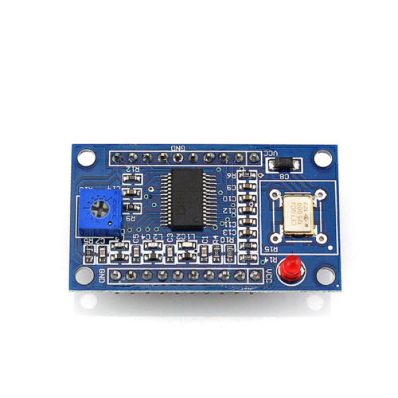

JDDS is a physical device that can connect to the JMSK program to act as the MSK modulator.

In these folders an Arduino implementation with an AD9850 module is given.
Both the source code and hardware design is given.

The source code including the required libraries are given in the folders [jddsmsk](jddsmsk) and [libraries](libraries).
The hardware design is included in the [eagle](eagle) folder.

An Arduino is a common open source hardware platform for prototyping, more information see https://www.arduino.cc/ .

The AD9850 module used for the hardware is pictured below.

I bought a couple for five US dollars each a while ago but they seem to be somewhat more expensive these days.
There seem to be a few different looking modules that can be bought but they all appear to have the same pinouts.

For practical implementations of the hardware, an amplifier as well as a filter is probably required.
Being MSK any nonlinear amplifier such as a class D or E or F will suffice.
No amplifier or filter design is given here.

Jonti

