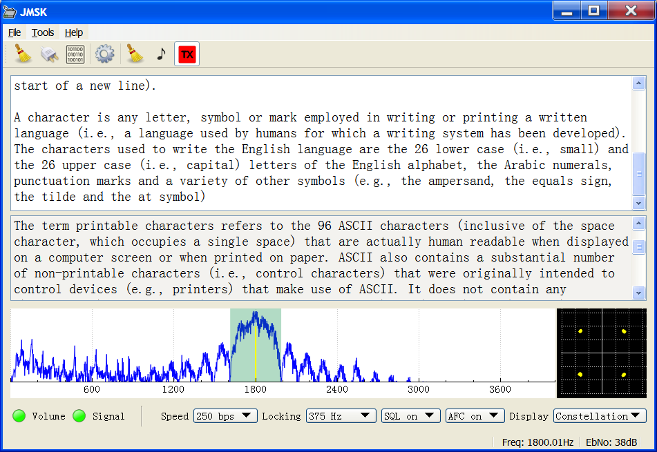

# JMSK
An MSK modem written in C++ Qt

This program can demodulate and modulate MSK (*minimum shift keying*) signals. Demodulation is performed using the soundcard, while modulation can be either via the soundcard or the via an external device to RF (*Radio Frequency*) frequencies using some simple hardware as described in the [JDDS-Arduino](JDDS-Arduino) section.

The demodulator implements a coherent MSK demodulator type as seen at http://jontio.zapto.org/hda1/msk-demodulation2.html.

The demodulator uses the technique that treats the signal similar to [OQPSK] but with sine wave transitions rather than rectangular transitions. The BER (*Bit Error Rate*) versus EbNo (*Energy per bit to Noise power density*) performance in the presence of AWGN (*Additive White Gaussian Noise*) is the same as coherently demodulated differentially encoded [BPSK]. While designed for MSK it will also demodulate [GMSK]. The signal is supplied via the audio input of the computer’s soundcard.
The software implements differential decoding hence the modulator must use differential encoding. The demodulator can decode varicode encoded text. The output of the demodulator can be directed to either a built-in console or to a [UDP] network port.

The modulator can either output audio frequency MSK to the soundcard which is suitable for devices such as [SSB] transmitters that can be controlled via serial PTT (*push to talk*), or alternatively can be connected to simple hardware such as consisting of an [Arduino] and an AD9850 module as described in the [JDDS-Arduino](JDDS-Arduino) section to directly modulate RF waves.

There is currently no interleaving or FEC (*Forward Error Correction*) and therefore is compatible with other applications that can modulate MSK with [Varicode] such as [Spectrum Lab]. This is convenient for testing and comparison purposes.

##Directory structure

The [JMSK](JMSK) directory is where the Qt pro file is for the main application. The [udptextserver](udptextserver) directory is a small demo application for receiving data sent from JMSK. The [JDDS-Arduino](JDDS-Arduino) directory contains both the source code and hardware design for a device (called a JDDS device) that can connect to JMSK to output MSK modulated RF frequencies.

##Compiling JMSK

Compiling JMSK requires the Qt framework which can be obtained from http://www.qt.io/download-open-source/ . Qt Creator can be used to compile JMSK and comes with the Qt framework. At least version 5 of the Qt framework is required. Currently MinGW and GCC work as compilers but VC++ does not.

After installing Qt download the JMSK zip or the tar.gz source file to your computer. No other third-party downloads should be required.

Open the [JMSK/JMSK.pro](JMSK/JMSK.pro) file with Qt creator where by Qt should ask you a few simple questions as to how to build JMSK. finally click build then run.

Jonti 2015
http://jontio.zapto.org

[OQPSK]: https://en.wikipedia.org/wiki/Phase-shift_keying#Offset_QPSK_.28OQPSK.29
[GMSK]: https://en.wikipedia.org/wiki/Minimum-shift_keying#Gaussian_minimum-shift_keying
[BPSK]: https://en.wikipedia.org/wiki/Phase-shift_keying#Binary_phase-shift_keying_.28BPSK.29
[UDP]: https://en.wikipedia.org/wiki/User_Datagram_Protocol
[SSB]: https://en.wikipedia.org/wiki/Single-sideband_modulation
[Arduino]: https://www.arduino.cc/
[Varicode]: https://en.wikipedia.org/wiki/Varicode
[Spectrum Lab]: http://www.qsl.net/dl4yhf/spectra1.html
