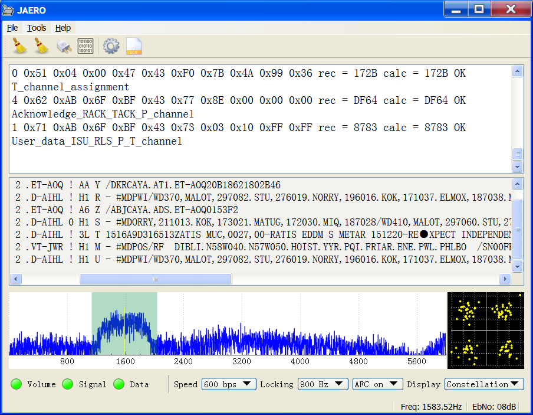
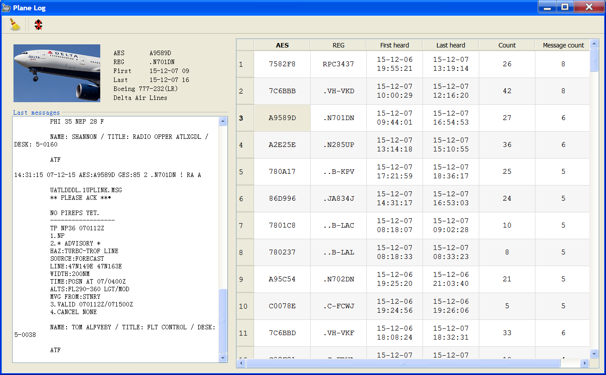

# JAERO
A SatCom ACARS demodulator and decoder for the Aero standard written in C++ Qt

This program demodulates and decodes ACARS messages sent from satellites to Aeroplanes (SatCom ACARS) commonly used when Aeroplanes are beyond VHF range. Demodulation is performed using the soundcard.
Such signals are typically around 1.5Ghz and can be received with a simple low gain antenna that can be home brewed in a few hours in conjunction with a cheap [RTL-SDR] dongle.

SatCom ACARS signals are basically MSK like so the demodulator was forked from [JMSK]. The demodulator implements a coherent MSK demodulator type as seen at http://jontio.zapto.org/hda1/msk-demodulation2.html.

The 600 and 1200 bps demodulator uses the technique that treats the signal similar to [OQPSK] but with sine wave transitions rather than rectangular transitions. The BER (*Bit Error Rate*) versus EbNo (*Energy per bit to Noise power density*) performance in the presence of AWGN (*Additive White Gaussian Noise*) is the same as coherently demodulated differentially encoded [BPSK]. While designed for MSK it will also demodulate [GMSK] and some types of [BPSK]. The signal is supplied via the audio input of the computer’s soundcard.
The software implements differential decoding hence the modulator must use differential encoding. The output of the demodulator can be directed to either a built-in console or to a [UDP] network port.

An OQPSK demodulator supports the faster 10.5k Aero signals.

Both 1200 and 10.5k burst C-band signal demodulation (From plane to ground station) are supported.

## Binaries

Precompiled binaries can be downloaded from [Releases].

## Directory structure

The [JAERO](JAERO) directory is where the Qt pro file is for the main application. The [udptextserver](udptextserver) directory is a small demo application for receiving data sent from JAERO.

## Compiling JAERO

Compiling JAERO requires the Qt framework which can be obtained from http://www.qt.io/download-open-source/ . Qt Creator can be used to compile JAERO and comes with the Qt framework. At least version 5 of the Qt framework is required. Currently MinGW and GCC work as compilers but VC++ does not.

After installing Qt download the JAERO zip or the tar.gz source file to your computer. Libcorrect may need to be obtained https://github.com/quiet/libcorrect.git and compiled separately (this uses cmake).

Open the [JAERO/JAERO.pro](JAERO/JAERO.pro) file with Qt creator where by Qt should ask you a few simple questions as to how to build JAERO. finally click build then run (make sure the shared or static library of libcorrect is available to the build process).

## Thanks

I'd like to thank everyone who has given their kind support for JAERO over the years. Thanks for Otti for getting the project started, John and Bev for setting up a worldwide large dish network, everyone who has donated, the people who have send feedback, people who use JAERO, and Jeroen who done an excellent job programming new code for JAERO to bring some features that I’m sure will be appreciated by many.

Jonti 2018
http://jontio.zapto.org

[OQPSK]: https://en.wikipedia.org/wiki/Phase-shift_keying#Offset_QPSK_.28OQPSK.29
[GMSK]: https://en.wikipedia.org/wiki/Minimum-shift_keying#Gaussian_minimum-shift_keying
[BPSK]: https://en.wikipedia.org/wiki/Phase-shift_keying#Binary_phase-shift_keying_.28BPSK.29
[UDP]: https://en.wikipedia.org/wiki/User_Datagram_Protocol
[SSB]: https://en.wikipedia.org/wiki/Single-sideband_modulation
[Arduino]: https://www.arduino.cc/
[Varicode]: https://en.wikipedia.org/wiki/Varicode
[Spectrum Lab]: http://www.qsl.net/dl4yhf/spectra1.html
[JMSK]: https://github.com/jontio/JMSK
[RTL-SDR]: http://www.rtl-sdr.com/about-rtl-sdr/
[Releases]: https://github.com/jontio/JAERO/releases
